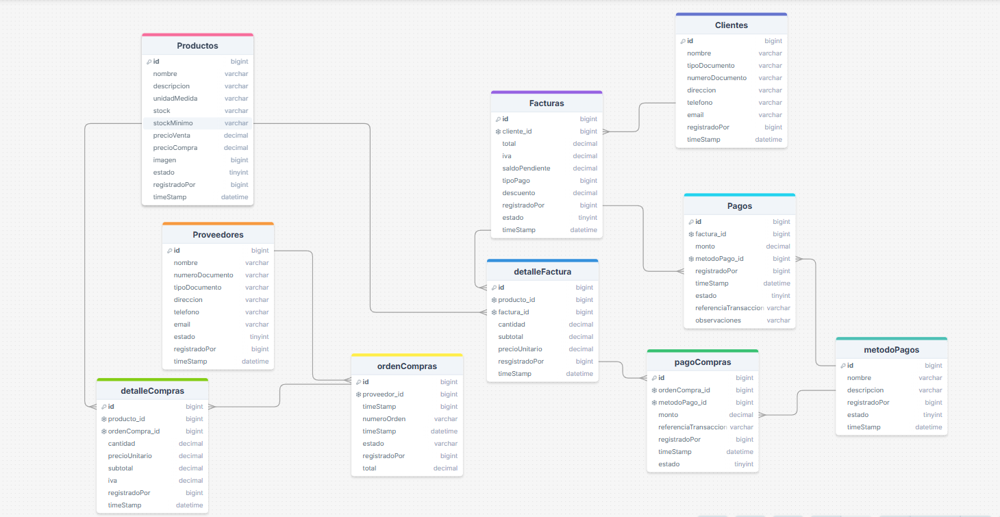

# 🔹Proyecto de pagina web para un minimercado

## 🔹Modelo entidad relacion 

### link:https://drawsql.app/teams/clmc/diagrams/ventas-comprasmercado

## 🔹 Supuestos del sistema

1. Cada **factura** pertenece a un único **cliente**, pero un cliente puede tener varias facturas.
2. Una **factura** puede tener uno o varios **productos** registrados en el **detalleFactura**.
3. Los precios de los productos (compra y venta) pueden cambiar, pero en el detalle de factura y detalle de compras se guarda el precio vigente en el momento de la transacción.
4. El inventario de productos se actualiza automáticamente según las ventas **(disminuye)** y las compras **(aumenta)**.
5. Los **pagos** y **compras** pueden ser **totales o parciales**, y una factura puede quedar con **saldo pendiente** hasta completarse.
6. Los **métodos de pago** son configurables (efectivo, tarjeta, transferencia, etc.) y pueden variar según las necesidades de la empresa.
7. Cada **orden de compra** está asociada a un único proveedor, y un proveedor puede tener múltiples órdenes de compra.
8. Las órdenes de compra tienen estados (pendiente, recibida, anulada).
9. Todos los registros tienen trazabilidad mediante los campos **registradoPor** y **timeStamp**.
10. Los campos **estado** permiten activar/inactivar entidades sin eliminarlas físicamente.

## 🔹 Requerimientos funcionales

### 📦 Gestión de productos

-   Registrar, modificar, consultar y dar de baja productos.
-   Controlar inventario mediante stock y stock mínimo.
-   Clasificar productos por categorías y unidad de medida.

### 👤 Gestión de clientes

-   Registrar clientes con sus datos personales y de contacto.
-   Consultar, editar y dar de baja clientes.
-   Identificar clientes mediante un documento único (cédula, NIT, etc.).

### 🚚 Gestión de proveedores

-   Registrar, modificar y consultar proveedores.
-   Asociar órdenes de compra a un proveedor.
-   Activar/inactivar proveedores.

### 🧾 Facturación (ventas)

-   Crear facturas asociadas a un cliente.
-   Agregar productos a la factura (detalleFactura) con cantidad, precio, descuento e impuestos.
-   Calcular automáticamente subtotal, impuestos, descuentos y total.
-   Cambiar estado de la factura (pendiente, pagada, anulada).

### 💵 Pagos de facturas

-   Registrar pagos parciales o totales de facturas.
-   Asociar un pago a un método de pago.
-   Consultar historial de pagos por factura.
-   Dejar observaciones y referencia de transacción en los pagos.

### 📑 Compras (abastecimiento)

-   Generar órdenes de compra a proveedores.
-   Registrar productos comprados en **detalleCompras** con cantidad, precio e impuestos.
-   Actualizar automáticamente el inventario al recibir una compra.
-   Gestionar pagos de compras y su historial.

### 💳 Métodos de pago

-   Registrar, editar y dar de baja métodos de pago.
-   Asociar pagos de ventas y compras a un método de pago.

### 📊 Reportes y consultas

-   Reporte de ventas por cliente, producto, fechas.
-   Reporte de facturas con saldo pendiente.
-   Reporte de compras por proveedor y fechas.
-   Reporte de inventario (stock actual y productos con stock mínimo).

## 🔹 Requerimientos no funcionales

### 🦺Seguridad:

-   Control de acceso por usuario (registradoPor).
-   Validación de datos (ejemplo: no permitir facturas sin cliente ni detalle).

### 🧗🏾‍♂️Escalabilidad:

-   La base de datos debe soportar grandes volúmenes de facturas, productos y clientes.

### 🚮Usabilidad:

-   Interfaz intuitiva para registrar facturas y pagos rápidamente.

### ☝️Disponibilidad:

-   El sistema debe estar disponible la mayor parte del tiempo para no interrumpir las ventas.

Faltan pero estan en proceso
